(The first 3 entries are entered after the fact, due to not knowing the requirement of a journal. Beyond those three, however, screenshots are taken while working)

# May 9th: Began project!

Today I began the project by initializing PlatformIO. I haven't used PlatformIO before, however decided it would be a good idea to learn it rather than conventional arduino ide.

I began by adding in my MCU of choice. In this case, an ESP32-S3, and connecting the pins.

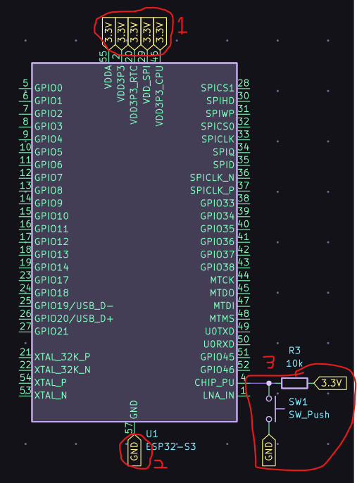

1. The power pins, connected to the power system shown in the next image.
2. GND, connected to the power system.
3. A reset button to reset the MCU.

I also created a power delivery system. I knew I'd use usb, however didn't think data was necessary. And so, I picked a 6 pin power only usb c receptacle. I used the first step down converter (5v -> 3.3v) chatgpt suggested, which in this case was the NCP1529A, with configuration to step down from 5v to 3.3v using resistors. This provides 3.3V, with GND provided by the usb.

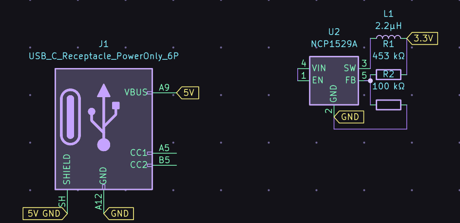

# May 10th: Making the MCU functional.

Today, I set out to provide everything a dev board normally would to the ESP32-S3. QSPI RAM, etc.
I also fixed some flaws in my PD system.

QSPI was simple. A quick google brang up the recommended chip, and the pins where very self explanatory.

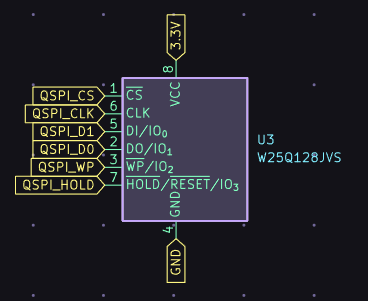
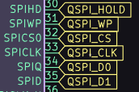

I brought a battery into the PD loop, and chose the BQ24074RGT battery charger for it's simplicity.

Just add in the charger, with the battery.

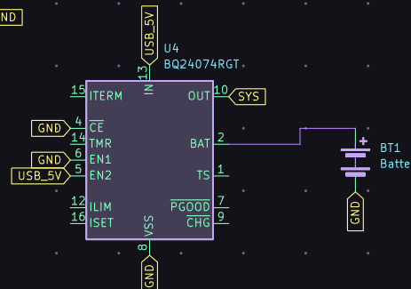

That's all for today.

# May 11th: Adding the display.

Today brought a lot of progress. I'll show the progress in order of the github commits, which represent the sessions.

## First session

I couldn't dig up the docs, so took chatgpt's word about the pinout of the display driver I was using. Big mistake, as you'll see later.

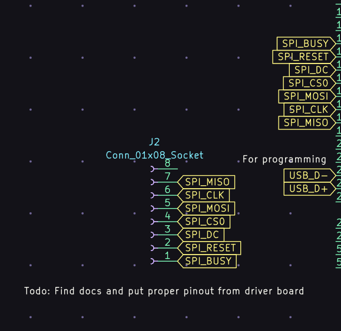

No other changes, except for choosing the SPI positions on the ESP32-S3 for the display.

## Second session

Replaced the port with a data port. USB 2 is sufficient, so I used that. Everything else remained the same.

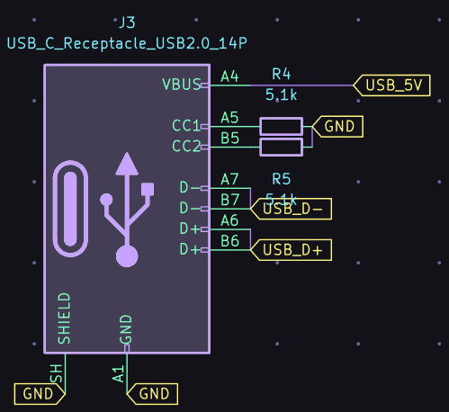

I dug up the docs for the display and found that chatgpt was horribly wrong.

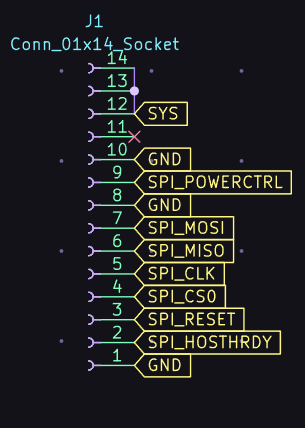

I also added the crystal for time, using the CDX-1293.

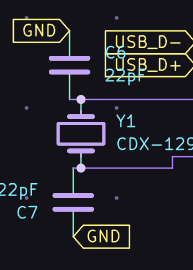

I also added decoupling capacitors.

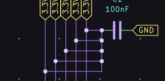

## Third session

I added the touch interface.

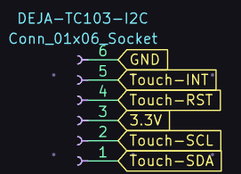

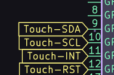

# May 13th: Antennas and PCB design

Today I added an antenna to the esp32.

[WIP] add img

I then later replaced it with a proper implementation.

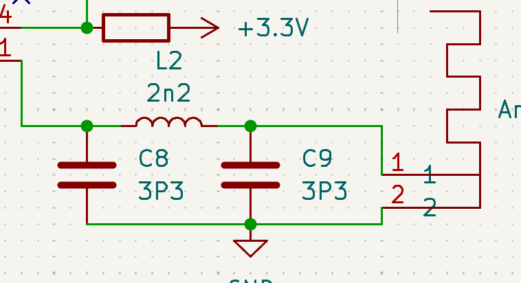

WIP add footprint img

I also replaced the PCB with a proper two layer one, the bottom layer being GND.

I later chose to make the PCB 4 layer, distributing 3.3v, GND and having two routing layers.

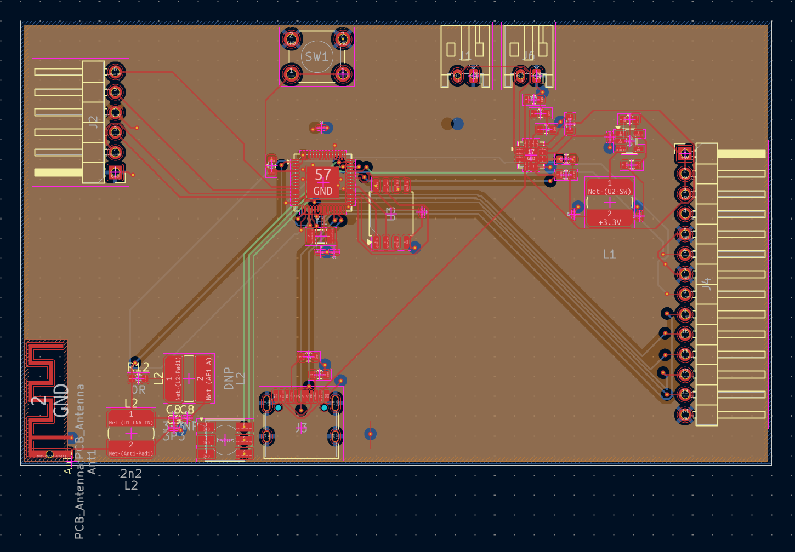

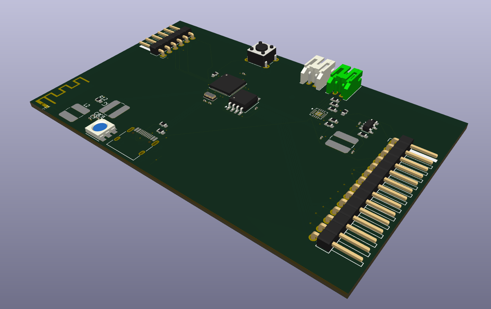
